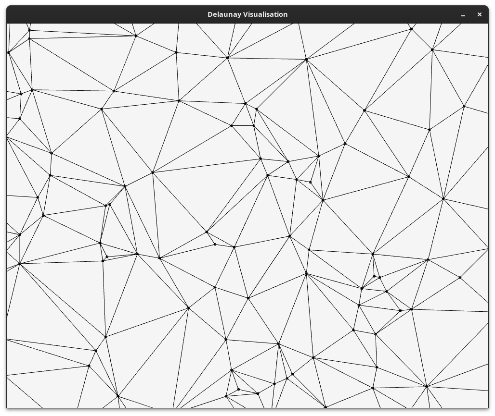
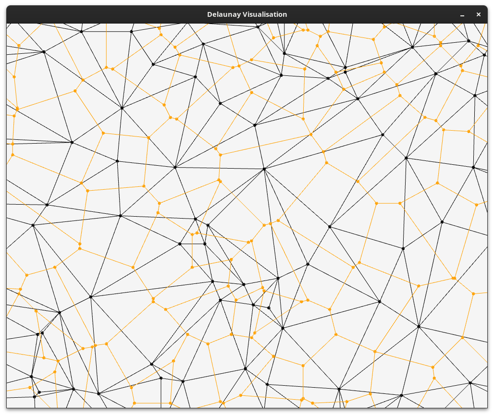

# Delaunay Triangulation
_with Vornoi Graph_

This C++ library implements the Delaunay Triangulation algorithm described in the paper "Primitives for the Manipulation of General Subdivisions and the Computation of Voronoi Diagrams" by LEONIDA GUIBAS and JORGE STOLFI.
It utilizes the Quad Edge data structure to represent two graphs (the primary delaunay graph and its dual, the vornoi grpah) with one data structure. 

## Screenshots



## Usage Example
```c++
// Run algorithm
delaunay::Delaunay triangulation = delaunay::Delaunay::triangulate(points);

auto primary = triangulation.get_primary_edges(); // Get Delaunay Edges
auto dual = triangulation.get_dual_edges(); // Get Vornoi Edges
```

## Quad Edges
The QuadEdge data structure is basically a giant linked list, giving quick access
to the primal and dual. In this context the primal is the Delaunay Triangulation while the
dual is the Voronoi Graph. This also makes navigating and modifying the mesh really easy.

An Edge is not only represented by its simple origin and destination, but is rather split into
4 half edges, representing the symmetric edge, the dual edge, and the symmetric dual edge, and
the edges sharing the same origin. Thus navigating around a vertex or a face is quite simple.
This is implemented by storing two pointers for each edge: ``p_onext`` and ``p_rot``. 

A movement in the next direction is always in the counter clockwise direction
A movement in the prev direction is always in the clockwise direction.

Read more here: https://www.cs.cmu.edu/afs/andrew/scs/cs/15-463/2001/pub/src/a2/quadedge.html

### Operations
#### Sym
Gets the QuadEdge with the same orientation but opposite direction

#### Rot
Rotates around the Edges of the QuadEdge data structure, switching between
the dual and the primal edge. Rotating the Edge by 90° counterclockwise.


The edge eRot is the dual of the edge e, direct from eRight to eLeft (Pointing to the left Face of e).
eRot = eFlipDual = eDualFlipSym
eSym = eRot²

#### orbit_next (onext)
Counter clockwise rotation around the origin of this edge

#### orbit_prev (oprev)
Clockwise rotation around the origin vertex of this edge

#### left_face_next (Lnext)
The next (moving counter clockwise) edge in the face that is on the left to this one.
Meaning the returned edge is the first edge we encounter after this edge, when moving along the boundary of the face F = eLeft in the counter clockwise direction.

#### left_face_prev (Lprev)
The prev (moving clockwise) edge in the face that is on the left to this one
Meaning the returned edge is the first edge we encounter after this edge, 
when moving along the boundary of the face F = eLeft in the clockwise direction.

#### right_face_next (Rnext)
The next (moving counter clockwise) edge in the face that is on the right to this one.
Meaning the returned edge is the first edge we encounter after this edge,
when moving along the boundary of the face F = eRight in the counter clockwise direction.

#### right_face_prev (Rprev)
The prev (moving clockwise) edge in the face that is on the right to this one
Meaning the returned edge is the first edge we encounter after this edge,
when moving along the boundary of the face F = eRight in the clockwise direction.

